# Credit_Risk_Analysis

## Overview of the analysis:
The purpose of this analysis was to oversample and undersample the credit card dataset from LendingClub. This was to be done using the RandomOverSampler and SMOTE algorithms for oversampling and the ClusterCentroids algorithms for undersampling. Overall we wish to structure a machine learning model that is capable of predicting credit risk with the highest accuracy.

## Results: 

### RandomOverSampler
In the machine model, in order to oversample, the RandomOversSampler was used within a Logistic Regression model. The following are key results to note: 
- The Counter:
  - Low risk = 51,366
  - High risk = 51,366
- The Random State = 1. 
- The Accuracy Score = 64%

The confusion matrix and imbalanced classification report are as follows:
- Confusion Matrix

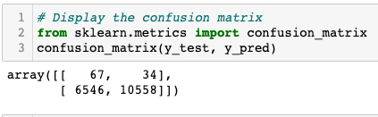

- Imbalanced Classification Report

### SMOTE
In the machine model, another method of oversample, is via the SMOTE oversampling within a Logistic Regression model. The following are key results to note: 
- The Counter:
  - Low risk = 51,366
  - High risk = 51,366
- The Random State = 1. 
- The Accuracy Score = 65%

The confusion matrix and imbalanced classification report are as follows:
- Confusion Matrix

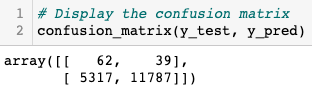

- Imbalanced Classification Report

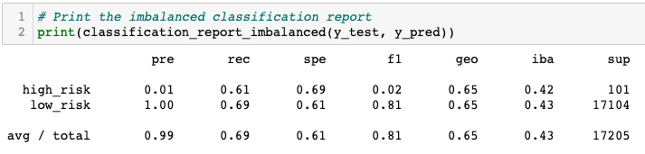

### ClusterCentroids
In the machine model, in order to undersample the data, the ClusterCentroids was used within a Logistic Regression model. The following are key results to note: 
- The Counter:
  - Low risk = 246
  - High risk = 246
- The Random State = 78. 
- The Accuracy Score = 54%

The confusion matrix and imbalanced classification report are as follows:
- Confusion Matrix

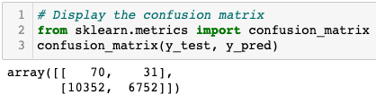

- Imbalanced Classification Report

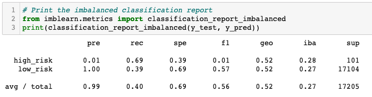

### SMOTEENN
In the machine model, we will now perform both oversampling and undersampling combined by using the SMOTEENN algorithm within the Logistic Regression model. The following are key results to note: 
- There is no Counter
- The Random State = 1. 
- The Accuracy Score = 64%

The confusion matrix and imbalanced classification report are as follows:
- Confusion Matrix

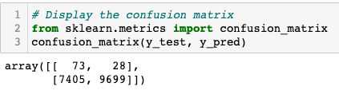

- Imbalanced Classification Report

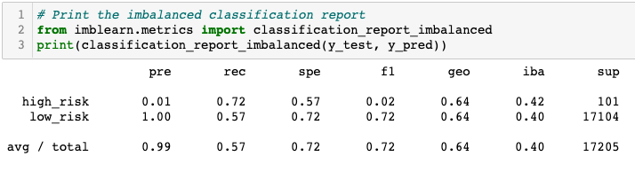

### BalancedRandomForestClassifier
In the machine model, we will now use one of two ensemble learning algorithms and decide on the best performance from there. For this section, we are using the Balanced Random Forest Classifier.

The following are key results to note: 
- The Counter is the same for both algorithms:
  - Low risk: 51,357
  - High risk: 255
- n-estimators = 100
- The Random State = 1. 
- The Accuracy Score = 79%

The confusion matrix and imbalanced classification report are as follows:
- Confusion Matrix

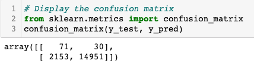

- Imbalanced Classification Report

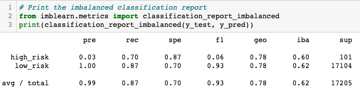

### EasyEnsembleClassifier
In the machine model, we will now use one of two ensemble learning algorithms and decide on the best performance from there. For this section, we are using the EasyEnsembleClassifier.

The following are key results to note: 
- The Counter is the same for both algorithms:
  - Low risk: 51,357
  - High risk: 255
- n-estimators = 100
- The Random State = 1. 
- The Accuracy Score = 93%

The confusion matrix and imbalanced classification report are as follows:
- Confusion Matrix

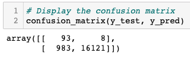

- Imbalanced Classification Report

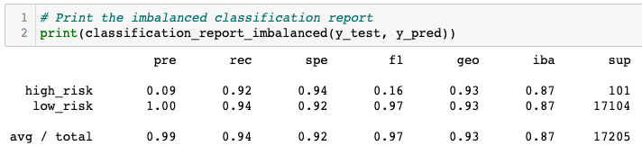

## Concluding Summary
In Summary of the results, we looked at both Resampling Models and Ensemble Learning Models to attempt to identify the best machine model to predict credit risks. 

Within each of these models, we tried out different algorithms. The algorithms under each model are as follows along with their accuracies:

- Resampling Model
  - RandomOverSampler: 64%
  - SMOTE: 65%
  - ClusterCentroids: 54%
  - SMOTEENN: 64%

- Ensemble Learning
  - BalancedRandomForestClassifier: 79%
  - EasyEnsembleClassifier: 93%

Based on the results obtained for this analysis, the least recommended machine model and algorithm is the Resampling Model, using the ClusterCentroids algorithm. The best model for this analysis is Ensemble Learning that consisted of both the EasyEnsembleClassifier and BalancedRandomForestClassifier. These produced the greatest accuracies of all machine models. In regard to the most accurate of all algorithms, the EasyEnsembleClassifier was the best with an accuracy of 93%. With the accuracy of 93%, we can concluse that this model can be utilized to predict credit risk amongst applicants.
